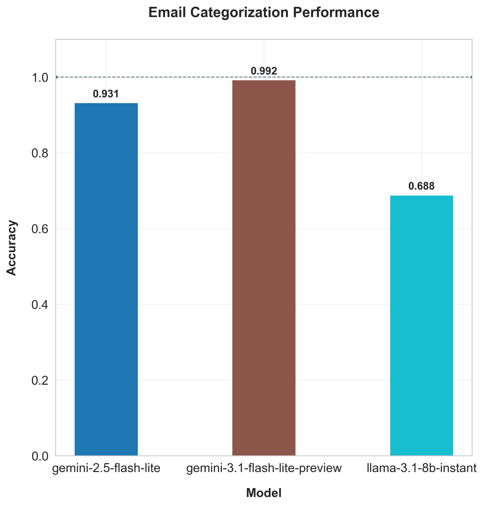
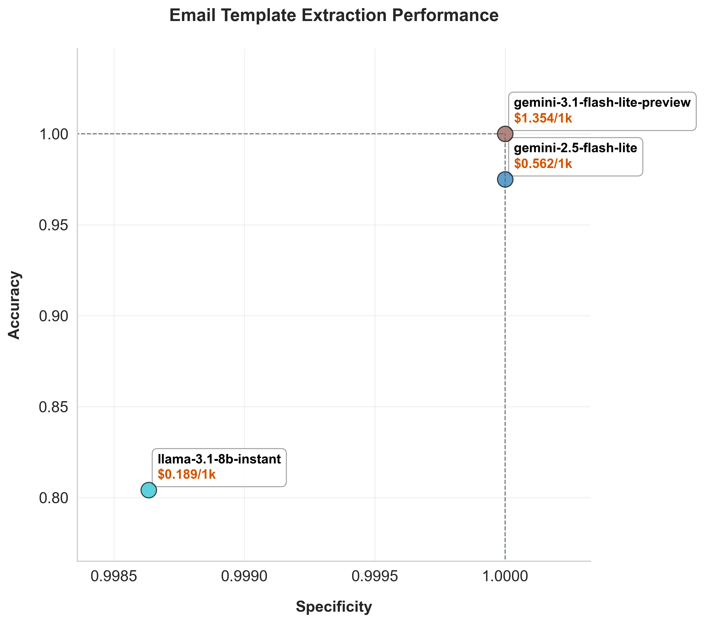

<!-- PROJECT LOGO -->
 

  <h3 align="center">Sublog Api MLOps</h3>

  

    Pipeline for dataset synthesis and LLM benchmarking.
     
  

## About The Project

This is MLOps of Sublog api server.  
For introduction of the app, please refer to following repo of the API server.
<a href="https://github.com/EAexist/subscription-killer-api">Sublog
API</a>

This project synthesizes datasets for development and testing of the Sublog API project. The datasets are used for AI-backed tasks that are actually used in the Sublog API project when handling requests.

## Latest Results

### Synthesized Dataset

https://huggingface.co/datasets/hyeon-expression/subscription-killer-synthetic-emails

### LLM Benchmark

| Email Categorization | Template Extraction |
| :---: | :---: |
|  |  |

## Core Capabilities

### Automated Dataset Synthesis

Datasets are generated by an oracle LLM and validated before use, ensuring consistent and reproducible benchmarks for development and testing of the AI-backed service.

### Professional Model Evaluation

Multiple AI models are evaluated on real business tasks, providing per-task diagnostics to help choose the best model.

### Scalability

Designed for future integration as an Airflow pipeline.

## Built With

* [![Python][Python]][Python-url]

<!-- LICENSE -->
## License

Copyright (c) 2026 Hyeon Pyo. All rights reserved.

No permission is granted for commercial use, distribution, or modification without explicit consent.

<!-- CONTACT -->
## Contact

Pyohyeon: hyeon.expression@gmail.com

Project Link: [https://github.com/EAexist/llm-benchmark](https://github.com/EAexist/llm-benchmark)

<!-- ACKNOWLEDGMENTS -->
## Acknowledgments

<!-- * [OpenAI API](https://platform.openai.com) -->
* [Google Gemini API](https://aistudio.google.com/welcome)
* [Best-README-Template](https://github.com/othneildrew/Best-README-Template)

(<a href="#readme-top">back to top</a>)

<!-- MARKDOWN LINKS & IMAGES -->
[Python]: https://img.shields.io/badge/Python-3776AB?style=for-the-badge&logo=python&logoColor=white
[Python-url]: https://python.org